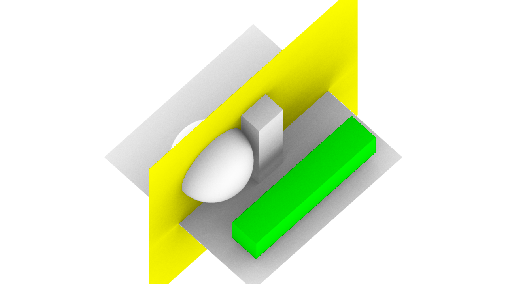
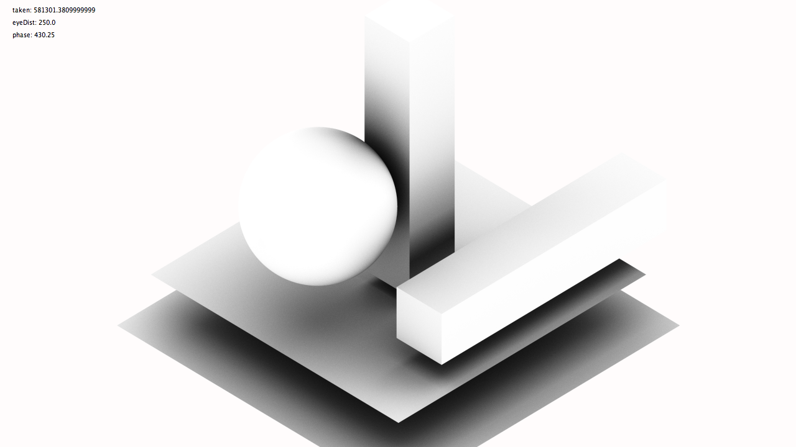
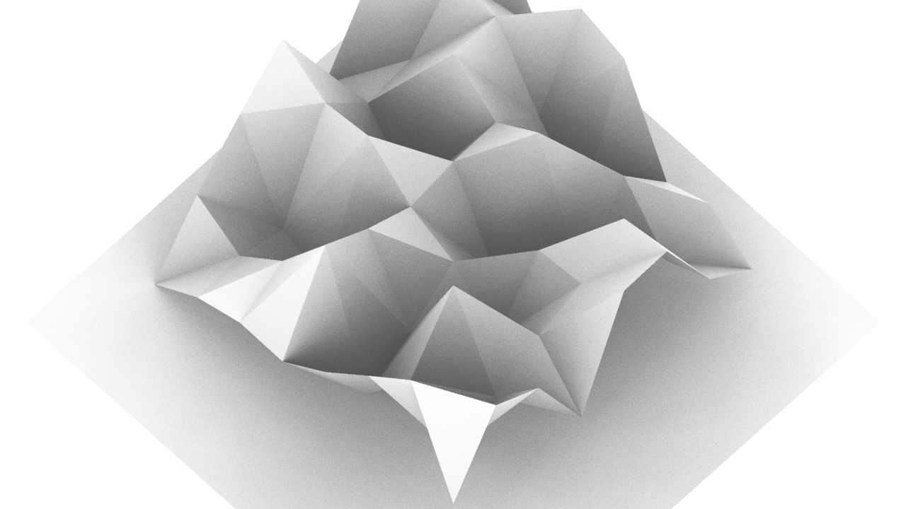
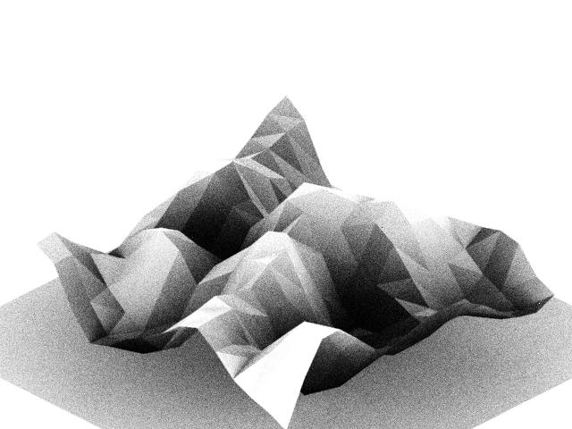

# iso-tracer

Tiny, isometric ambient-occlusion only raytracer written in Java &
[toxiclibs](https://github.com/postspectacular/toxiclibs) (with [Processing](https://processing.org) wrapper). Written in 2011, archived.

## Example scenes

| Example scene #1                |                                  |
|---------------------------------|----------------------------------|
|          |          |
| 256 samples (2x oversampling)   |                                  |
| **Example scene #2**            |                                  |
|  |  |
| 64 samples (2x oversampling)    |                                  |

## Related links/projects

- https://flickr.com/photos/toxi/albums/72157628612793099
- https://flickr.com/photos/toxi/albums/72157628230520643 (only partially)
- [thi.ng/raymarchcl](https://thi.ng/raymarchcl) (OpenCL based voxel renderer)

## License

&copy; 2011 Karsten Schmidt // ASL2.0 licensed
